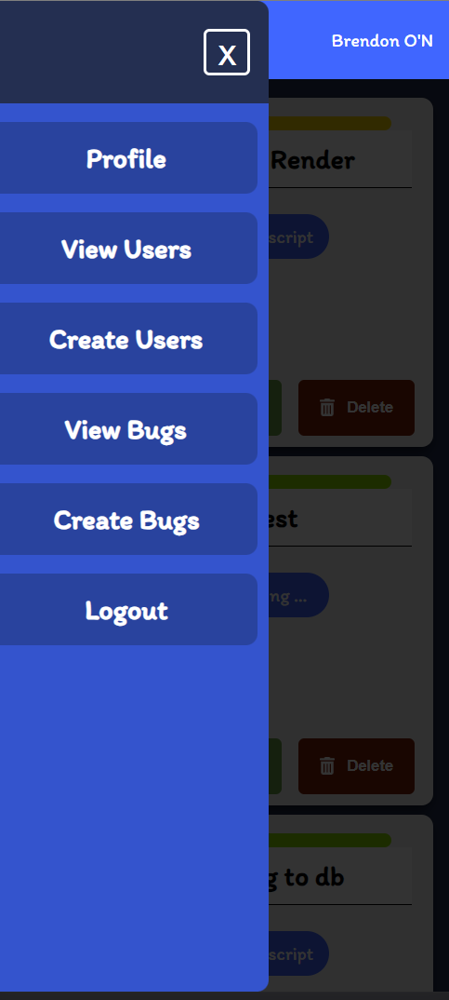
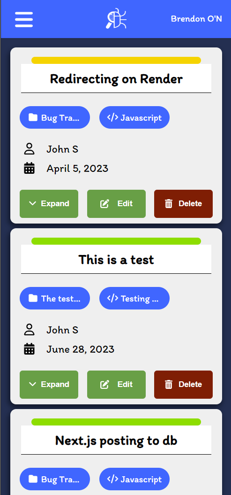

# Bug Tracking App V2
This is an updated version of the bug tracking app where I have moved over to next js from express. As I want to update the backend and clean up the UI for the Bug Tracker.

## UI update

## Working on
- Posting bugs and users
- Viewing bugs and users
- Understanding the flow of server side and client side rendering
- Designing new UI 
