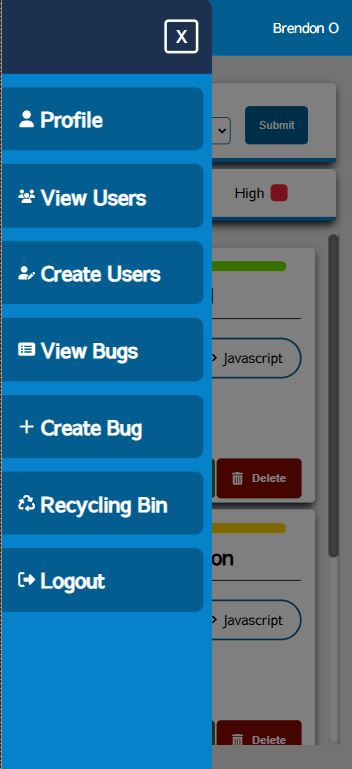
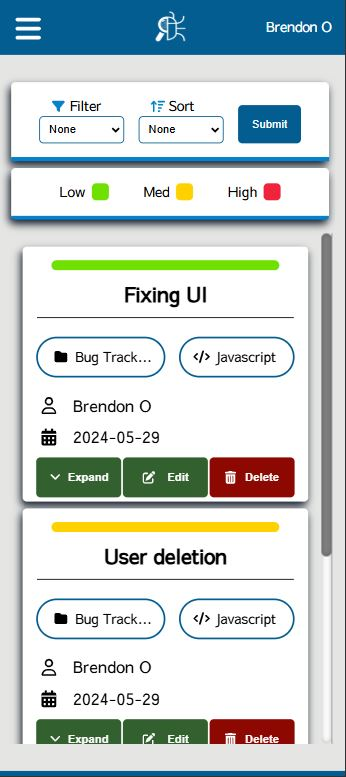
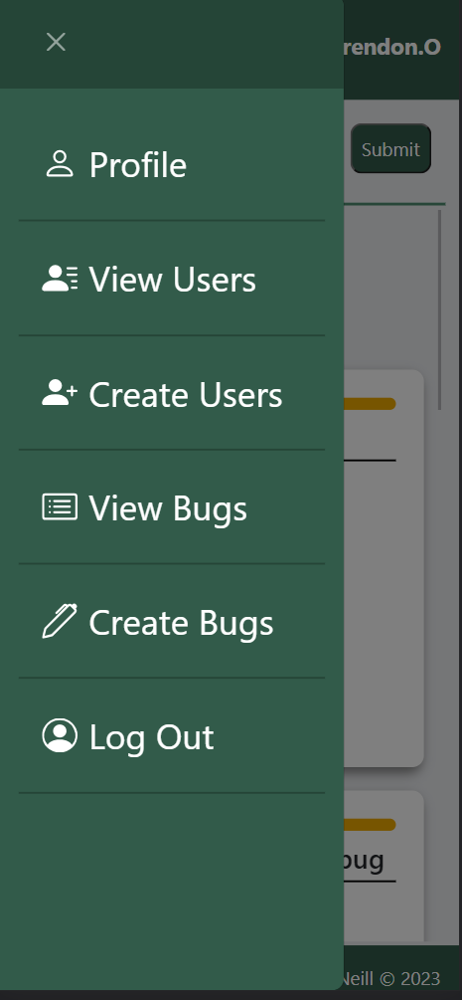
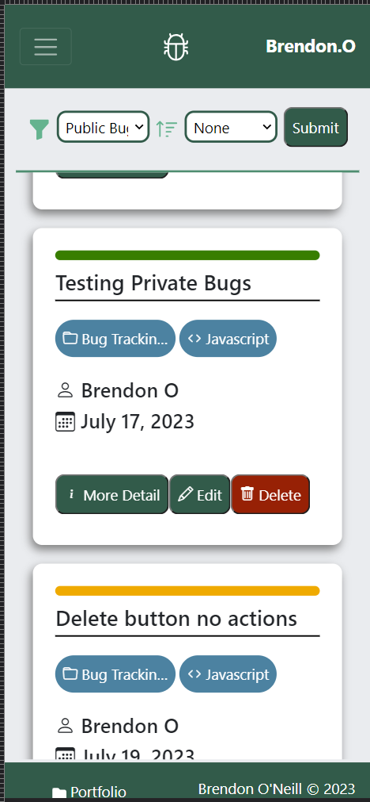

# Bug Tracking App V2
This is a demo bug-tracking app designed for companies to track and manage development bugs efficiently. This latest version has been upgraded from Express to Next.js, featuring an improved backend and a cleaner, more streamlined UI for a better bug-tracking experience.

> [!NOTE]
> To test out the app here are two accounts to check it out.
>
> Admin:
> ShaneK@gmail.com  pass:  rty9[0]q
>  
> User:
> ThomasK@gmail.com pass:  45[e!Ml@3
> 

## Features
- Easy sign-in to access your dashboard.
- Bug Tracking System – Create, update, and delete bug reports effortlessly.
- Collaborative Bug Comments – Comment on public bugs or keep discussions private for your reports.
- Filtering & Sorting – Organize bugs by priority, date, or other preferences.
- Recycling Bin for Deleted Bugs – Deleted bugs are stored for 30 days before permanent removal or remove them permanently yourself.
- User Management – Admins can create, update, or remove user accounts.
- Password Recovery System – Reset forgotten passwords securely.

## UI update
### New UI in Next.js
This UI will change as I clean up the app and it goes live. 

 

### Old UI in EJS
 
 

## Updated
- Password Recovery
- Updated some old features
- Cleaned up backend code

## Working on
- Cleaning up backend code
- Cleaning up some UI

## Extra features to add
- Adding a project section to create new projects and find bugs to do with that project.

