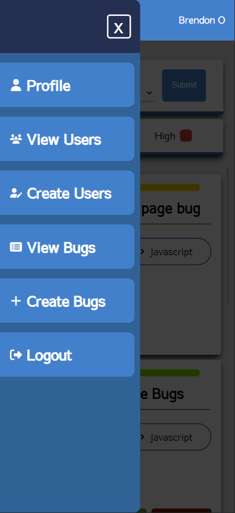
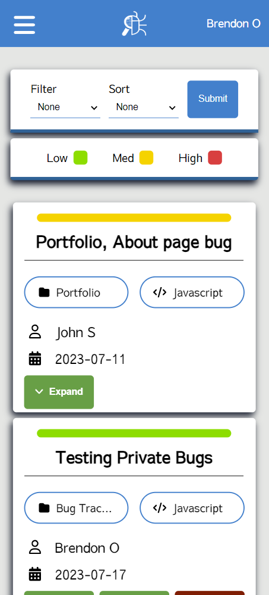
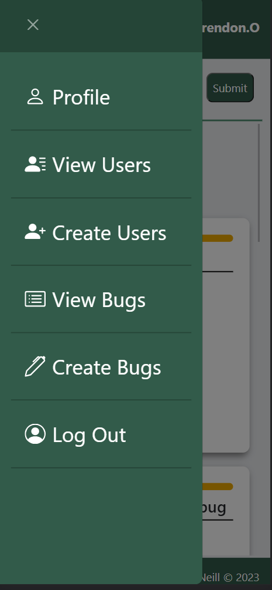
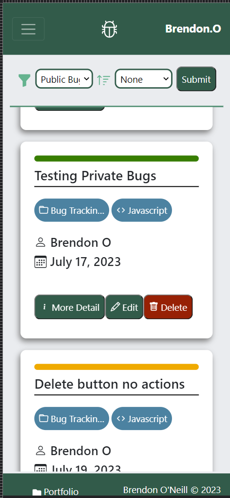

# Bug Tracking App V2
This is an updated version of the bug tracking app where I have moved over to next js from express. As I want to update the backend and clean up the UI for the Bug Tracker.

## UI update
### New UI in Next.js
This UI will change as I clean up the app and it goes live. 

 

### Old UI in EJS
 

## Working on
- Calling to API with logged in users id
- Filtering and sorting bugs and users
- Fixing UI bugs with client side
- Cleaning up code and using best
- updating Auth with Next Auth.
- pratice methods
- Designing new UI

- Cookie in use warning

## Researching
- Middleware
- Filtering cards with cleaner code
- Auth
- Comments on others cards
- Best way to deal with soft delete
